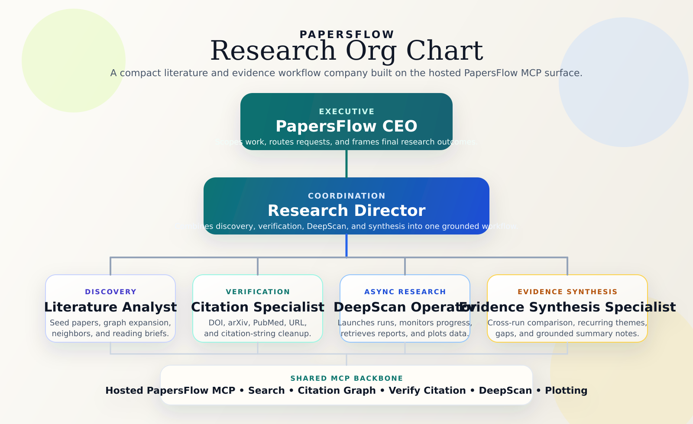

# PapersFlow

> A research-focused Agent Company for literature search, citation verification, graph exploration, and DeepScan workflows powered by the hosted PapersFlow MCP server

> An [Agent Company](https://agentcompanies.io) based on [papersflow-mcp](https://github.com/papersflow-ai/papersflow-mcp) and the reusable PapersFlow workflows referenced from [papersflow-skills](https://github.com/papersflow-ai/papersflow-skills)



## What's Inside

> This is an Agent Company package for PapersFlow research work.

| Content | Count |
|---------|-------|
| Agents | 6 |
| Skills | 4 |
| Tools | 14 |

### Agents

| Agent | Role | Reports To |
|-------|------|------------|
| PapersFlow CEO | CEO | — |
| Research Director | Director | ceo |
| Literature Analyst | Specialist | research-director |
| Citation Specialist | Specialist | research-director |
| DeepScan Operator | Specialist | research-director |
| Evidence Synthesis Specialist | Specialist | research-director |

### Skills

These skills are referenced from the public `papersflow-skills` repository rather than copied into this package.

| Skill | Description | Source |
|-------|-------------|--------|
| research-briefing | Build a focused literature and citation briefing from PapersFlow. | [github](https://github.com/papersflow-ai/papersflow-skills/blob/main/skills/research-briefing/SKILL.md) |
| citation-verifier | Verify, normalize, and enrich a single citation or paper identifier. | [github](https://github.com/papersflow-ai/papersflow-skills/blob/main/skills/citation-verifier/SKILL.md) |
| deepscan-monitor | Run and monitor PapersFlow DeepScan jobs. | [github](https://github.com/papersflow-ai/papersflow-skills/blob/main/skills/deepscan-monitor/SKILL.md) |
| comparative-synthesis | Compare and synthesize findings across multiple completed DeepScan reports. | [github](https://github.com/papersflow-ai/papersflow-skills/blob/main/skills/comparative-synthesis/SKILL.md) |

### Tools

| Tool | Access | Purpose |
|------|--------|---------|
| search | Public | Generic paper lookup |
| fetch | Public | Hydrate a resolved paper record |
| verify_citation | Public | Normalize or verify a citation string or identifier |
| search_literature | Public | Search the literature with a research-oriented interface |
| find_related_papers | Public | Find references, citations, or similar papers |
| get_citation_graph | Public | Build a seed-centered citation graph |
| get_paper_neighbors | Public | Retrieve one-hop grouped paper neighbors |
| expand_citation_graph | Public | Expand an existing citation graph |
| summarize_evidence | Authenticated | Summarize evidence across completed DeepScan history |
| run_deepscan | Authenticated | Start a DeepScan research run |
| get_deepscan_status | Authenticated | Check lightweight run status |
| get_deepscan_live_snapshot | Authenticated | Check richer live DeepScan progress |
| get_deepscan_report | Authenticated | Retrieve the final DeepScan report |
| run_python_plot | Authenticated | Plot stable DeepScan report data |

Full tool details live in [TOOLS.md](./TOOLS.md).

## MCP Endpoint

- MCP URL: `https://doxa.papersflow.ai/mcp`
- OAuth protected resource metadata: `https://doxa.papersflow.ai/.well-known/oauth-protected-resource`
- OAuth authorization server metadata: `https://doxa.papersflow.ai/.well-known/oauth-authorization-server`
- Dynamic client registration: `https://doxa.papersflow.ai/oauth/register`

## Getting Started

Import the full package from GitHub with `companies.sh`:

```bash
npx companies.sh add papersflow-ai/papersflow-company/papersflow --include company,agents,skills
```

If you have a local checkout and want to import it directly into Paperclip:

```bash
paperclipai company import ./papersflow --include company,agents,skills
```

Then connect the hosted MCP surface from a compatible client when needed:

- Codex
- Claude Code
- Gemini CLI
- ChatGPT-style MCP apps

For direct MCP setup details, see [papersflow-mcp](https://github.com/papersflow-ai/papersflow-mcp).
